# 🛡️ Azure Honeypot & Hybrid SOC (Wazuh)

  

## 📖 Project Overview

In this project, I engineered a cloud-based **Honeypot** to attract real-world cyberattacks and monitor them in real-time using a **SIEM (Security Information and Event Management)** system. 

Unlike standard cloud deployments, this project utilizes a **Hybrid Architecture**:
1.  **The Honeypot:** An Azure Ubuntu VM exposed to the internet.
2.  **The SOC:** A Wazuh Manager running locally on my private network (Mac/Docker).
3.  **The Link:** A secure, encrypted mesh VPN (Tailscale) connecting the two without exposing management ports.

**Objective:** To analyze SSH Brute Force patterns, understand attacker behavior, and map attacks to the **MITRE ATT&CK** framework.

---

## 🏗️ Network Architecture

The architecture consists of an intentionally vulnerable cloud instance forwarding logs securely to a local analyst machine via a zero-trust tunnel.

```mermaid
graph TD
    %% Nodes
    Attacker((🛑 ATTACKER))
    
    subgraph Azure_Cloud [☁️ Microsoft Azure Cloud]
        NSG{🛡️ NSG Firewall}
        VM[🖥️ Ubuntu Honeypot VM]
    end
    
    subgraph Home_Lab [🏠 Local Network / SOC]
        Manager[📊 Wazuh SIEM Manager]
    end

    %% Connections
    Attacker -- "SSH Brute Force (Port 22)" --> NSG
    NSG -- "Allowed Traffic" --> VM
    VM == "Encrypted Log Tunnel (Tailscale)" ==> Manager

    %% Styling
    style Attacker fill:#ff4d4d,stroke:#333,stroke-width:4px,color:white
    style VM fill:#0078D4,stroke:#333,stroke-width:2px,color:white
    style Manager fill:#00cc66,stroke:#333,stroke-width:2px,color:white
    style NSG fill:#ffcc00,stroke:#333,stroke-width:2px
```

# Azure + Wazuh Honeypot Project

## 🛠️ Technology Stack
* **Cloud Provider:** Microsoft Azure (Standard B1s VM)
* **Operating System:** Ubuntu 22.04 LTS
* **SIEM / XDR:** Wazuh (Manager & Dashboard via Docker)
* **Networking:** Tailscale (Zero Trust Mesh VPN)
* **Telemetry:** Syslog, Auth.log, SSHD
* **Visualization:** OpenSearch Dashboards

---

## ⚙️ Implementation Steps

### Phase 1: The Setup
* **Deployed** an Ubuntu VM on Azure.
* **Configured** the Network Security Group (NSG) to allow inbound traffic on **Port 22** from **Any** source (The Honey Trap).
* **Configured** a "Default Deny" policy for all other non-essential ports.

### Phase 2: The Infrastructure
* **Installed Wazuh Manager** locally on macOS using Docker Compose to preserve cloud costs.
* **Installed Tailscale** on both the Azure VM and the local Mac to create a private subnet.
* *Outcome:* This allowed the Wazuh Agent (Cloud) to talk to the Manager (Local) through a secure tunnel, bypassing the public internet for log transmission.

### Phase 3: The Detection
* **Deployed** the Wazuh Agent on the Azure VM.
* **Configured** the agent to monitor `/var/log/auth.log` for SSH authentication failures.
* **Verified** log ingestion and created custom alerts for high-intensity brute force attacks.

### Phase 4: Visualization
* **Enabled** the GeoIP module in Wazuh to correlate Source IPs with physical locations.
* **Built** a custom dashboard in OpenSearch to plot attack origins on a world map in real-time.

---

## 📊 Results & Visualization

### 1. Global Attack Map
Visualizing the origin of IPs attempting unauthorized SSH connections.
*(Note: This map shows the geo-location of attackers targeting the Azure VM)*

### 2. Alert & Detection Details
Specific log entry showing **MITRE ATT&CK T1110 (Brute Force)** mapping and GeoLocation enrichment.

---

## 🧠 Challenges & Learnings

> **Public IP SKU**
> I learned that Azure Standard Public IPs require explicit NSG associations at the NIC level, whereas Basic IPs are open by default. This required troubleshooting "0 Effective Rules" to get traffic flowing.

> **ICMP vs. TCP**
> Investigated why "Ping" failed while SSH worked; learned that Azure blocks ICMP by default and that service availability (TCP) is distinct from network reachability (ICMP).

> **Log Buffering**
> Managing log flow in a hybrid environment where the local receiver might be offline (sleeping Mac) required understanding the Wazuh Agent's buffer capabilities to prevent data loss.

---

## 📸 Project Screenshots

### Real-time Attack Map

### Brute Force Detection Details

---

## 🔗 References
* [Wazuh Documentation](https://documentation.wazuh.com)
* [MITRE ATT&CK T1110](https://attack.mitre.org/techniques/T1110/)
* [Tailscale Documentation](https://tailscale.com/kb/)
